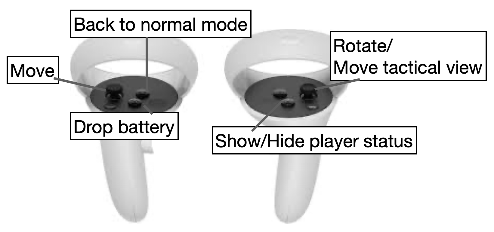

# Mazeworld


Welcome to MazeWorld, this project has evolved over time but the goal is still the exploration of how to evaluate team preformance. The idea is to have participants solve a maze where they are given different roles and tasks to complete. The roles consist of an explorer, collector, and tactical which have different interdependant roles. The explorer is responsible for navigating the maze, the collector is responsible for collecting coins, and the tactical is responsible for directing the explorer and collector. There is still quite a bit to be done on the project so hopefully this document will help explain the current state of the project as well as future goals.

Here is the current publication from the initial work on this project: [View Publication](https://scholar.google.com/citations?view_op=view_citation&hl=en&user=Wr3zbI8AAAAJ&citation_for_view=Wr3zbI8AAAAJ:u-x6o8ySG0sC)

## Table of Contents

- [Task List](#task-list)
- [Installation Guide](#installation-guide)
  - [Prerequisites](#prerequisites)
  - [Downloading the Project](#downloading-the-project)
  - [Setting Up Unity](#setting-up-unity)
- [Multiplayer Networking with Normcore](#multiplayer-networking-with-normcore)
  - [Features Utilized in MazeWorld](#features-utilized-in-mazeworld)
- [Script Overview](#script-overview)
  - [Player Management](#player-management)
  - [Avatar Control](#avatar-control)
  - [Environment Interaction](#environment-interaction)
  - [Tactical and Role-Based Mechanics](#tactical-and-role-based-mechanics)
  - [Game State and Networking](#game-state-and-networking)
  - [Utility and Support Scripts](#utility-and-support-scripts)
  - [VR Integration](#vr-integration)
  - [UI and Interaction](#ui-and-interaction)
- [Enhancements & Bug Fixes](#enhancements--bug-fixes)
  - [Implemented Changes](#implemented-changes)
    - [UltimateXR Integration Highlights](#ultimatexr-integration-highlights)
    - [Bug Fixes](#bug-fixes)
    - [Improvements](#improvements)

## Task List

- [ ] Place coins within the current maze and configure them correctly.
- [x] Setup the new start area and import the scripts from the old one. [Spring, 2024]
- [ ] Allow players to change between the two robot avatars and change color.
- [ ] Fix head and hands (OVRPlayerController) go through the walls.
- [ ] Add in logging functionality from the [VELLib](https://github.com/virtual-embodiment-lab/vellib).

[VELLib](https://github.com/virtual-embodiment-lab/vellib) is a collection of scripts that were made to support development of project in the Virtual Emobodiment Lab.

For more informaiton on how to work with VEL resources please visit the [onboarding](https://github.com/virtual-embodiment-lab/Onboarding) and [tutorial](https://github.com/virtual-embodiment-lab/unity-tutorial) documentation. If you do not have access to these respositories contact the lab manager for access.


## Installation Guide

This section outlines the steps needed to download the MazeWorld project, install Unity, and open the project in Unity Hub.

### Prerequisites

- Git must be installed on your computer. If Git is not installed, please download and install it from [git-scm.com](https://git-scm.com/).
- Unity Hub and Unity Editor are required. Download Unity Hub from the [Unity Download Page](https://unity.com/download), which facilitates the installation of the Unity Editor.

### Downloading the Project

1. Open your terminal or command prompt.
2. Navigate to the directory where you wish to download the MazeWorld project.
3. Clone the project repository by running the following command:

```bash
git clone https://github.com/virtual-embodiment-lab/teamwork.git
```

### Setting Up Unity

1. If not already installed, download and install Unity Hub from the Unity Download Page.
1. Open Unity Hub and go to the 'Installs' tab to install the Unity Editor. If unsure of which version to install, the required Unity version is typically specified in the project's README or the Unity project settings file (ProjectSettings/ProjectVersion.txt).
1. After installing the Unity Editor, navigate to the 'Projects' tab in Unity Hub.
Opening the Project in Unity Hub
1. In the 'Projects' tab of Unity Hub, click the 'Add' button.
1. Browse to the directory where you cloned the MazeWorld project.
1. Select the project folder and click 'Open', adding it to Unity Hub's project list.
1. To open the project, click on it in Unity Hub, which will launch it in the specified Unity Editor version.

## Multiplayer Networking with Normcore

MazeWorld uses [Normcore](https://normcore.io/) networking framework to deliver a seamless and interactive multiplayer Virtual Reality (VR) experience. Normcore is central to our ability to synchronize player actions in real-time, ensuring that every participant in the virtual environment experiences the same dynamic world simultaneously.

### Features Utilized in MazeWorld

- **Real-time Data Synchronization:** Normcore's real-time data synchronization is used to ensure that all interactive elements within the maze, including puzzles, obstacles, and collectibles, are consistently updated across all connected clients.
- **Voice Chat:** The built-in voice chat functionality of Normcore has been integrated to facilitate communication among players. This feature enhances teamwork and strategy as players navigate the mazes together.
- **Player Presence:** With Normcore's `RealtimeAvatar` system, the project supports dynamic player avatars that represent each participant in the virtual space, further enriching the sense of presence and immersion.

## How to Play


## Script Overview

MazeWorld includes a set of scripts that controll the game's mechanics, player interactions, environment behaviors, and networking aspects. Below is a summary of key scripts and their roles within the system:

### Player Management

- **`Player.cs`**: Manages individual player states, including movement and interactions within the virtual environment.
- **`PlayerManager.cs`**: Oversees all players in the game, handling tasks such as spawning and player-specific events.
- **`PlayerRoles.cs`**: Assigns and manages roles for each player, influencing their abilities and objectives within the game.
- **`PlayerRootSpawnPoint.cs`**, **`SpawnPoint.cs`**: Define spawn points for players and objects within the game world.

### Avatar Control

- **`AvatarManager.cs`**: Handles the creation and management of player avatars, ensuring accurate representation in the virtual space.
- **`CustomAvatarSpawnManager.cs`**: Specializes in spawning custom avatars, allowing for personalized appearances.
- **`LocalAvatarController.cs`**: Manages the local player's avatar, integrating with VR input for movement and actions.

### Environment Interaction

- **`AutomaticDoors.cs`**: Controls the behavior of automatic doors within the maze, responding to player proximity.
- **`Billboard.cs`**: Ensures certain UI elements always face the player, enhancing readability and interaction.
- **`Coin.cs`**, **`CoinParticles.cs`**: Define collectible items within the game and their visual effects upon collection.

### Tactical and Role-Based Mechanics

- **`TacticalControl.cs`**: Provides functionality for tactical roles, including overview maps and strategic planning tools.
- **`RoleTrigger.cs`**, **`TacticalControlTrigger.cs`**: Triggers that activate or modify player roles and tactical features upon interaction.

### Game State and Networking

- **`GameManager.cs`**: Central management script for game states, transitions between levels, and session control.
- **`MazeStateSync.cs`**: Synchronizes the state of the maze across all players, ensuring a consistent world view.
- **`MazeSelect.cs`**: Allows for selection of different maze configurations, adjusting the game's difficulty and layout.

### Utility and Support Scripts

- **`Utility.cs`**, **`Utils.cs`**: Provide general utility functions and helpers used across various scripts.
- **`Logger.cs`**, **`StandardLogging.cs`**: Facilitate logging for debugging and development purposes.
- **`ValueMap.cs`**, **`KVPair.cs`**: Used for mapping values and key-value pair management, supporting flexible data handling.

### VR Integration

- **`SimpleVRMovement.cs`**: Implements basic VR movement mechanics, allowing for natural player navigation.
- **`VRRigTransform.cs`**: Manages the transformation of VR rigs, ensuring accurate representation of player movements.

### UI and Interaction

- **`UIManager.cs`**: Manages the game's user interface, including menus, in-game indicators, and interactive elements.
- **`RoleSelect.cs`**: Interface for players to select their roles at the beginning of the game or upon respawning.

## Enhancements & Bug Fixes

### Implemented Changes

#### UltimateXR Integration Highlights

To enhance the stability and performance of MazeWorld, we have integrated [UltimateXR](https://www.ultimatexr.io/), a powerful XR framework designed for Unity.

- **Performance Optimization:** UltimateXR's efficient handling of VR-specific tasks has allowed us to enhance the performance of the MazeWorld application, reducing latency and improving frame rates even in complex maze environments.
- **Improved User Experience:** With UltimateXR's sophisticated input system, we've refined how players interact with the virtual world, offering more intuitive controls and interactions. This has directly contributed to a more immersive and engaging VR experience.

#### Bug Fixes

- **Tactical Visibility Improvement:** Updated the game to allow the tactical player to see the colors/shapes of activated coins, enhancing their contribution to the team's strategy.
- **Synchronization Fixes:** Resolved issues with the coin counter and session clock not updating correctly for all players, particularly affecting the tactical role.
- **Starting Area and Role Selection:** Fixed a bug where early role selection by one player could disrupt the roles and character colors for others joining the session.
- **Environmental Adjustment:** Removed an incorrectly placed "strawberry" object to prevent player confusion and maintain immersion.
- **Spawn Mechanics:** Corrected a spawn point issue to prevent players from falling off the map upon joining the game.

#### Improvements

- **Increased Maze Complexity:** Enlarged the maze size to offer a greater challenge and encourage more strategic navigation.
- **Enhanced Coin Diversity:** Introduced a wider variety of coin colors and shapes, along with increased randomness in their sequence, to avoid predictable patterns and promote exploration.
- **Added Navigational Cues:** Implemented visible landmarks, such as a mountain peak outside the maze, to aid in orientation and team communication.
- **Opt

## Dependencies

Ultimate XR: v0.9.7

Unity: 2020.3.15f1

```shell
{
  "dependencies": {
    "com.meta.xr.sdk.all": "60.0.0",
    "com.meta.xr.sdk.interaction.ovr.samples": "60.0.0",
    "com.normalvr.normcore": "2.6.3",
    "com.unity.ide.visualstudio": "2.0.22",
    "com.unity.ide.vscode": "1.2.5",
    "com.unity.inputsystem": "1.7.0",
    "com.unity.probuilder": "5.2.2",
    "com.unity.render-pipelines.universal": "14.0.9",
    "com.unity.test-framework": "1.3.9",
    "com.unity.textmeshpro": "3.0.6",
    "com.unity.timeline": "1.8.2",
    "com.unity.ugui": "1.0.0",
    "com.unity.visualscripting": "1.9.1",
    "com.unity.xr.interaction.toolkit": "2.5.2",
    "com.unity.xr.oculus": "4.1.2",
    "com.unity.modules.ai": "1.0.0",
    "com.unity.modules.androidjni": "1.0.0",
    "com.unity.modules.animation": "1.0.0",
    "com.unity.modules.assetbundle": "1.0.0",
    "com.unity.modules.audio": "1.0.0",
    "com.unity.modules.cloth": "1.0.0",
    "com.unity.modules.director": "1.0.0",
    "com.unity.modules.imageconversion": "1.0.0",
    "com.unity.modules.imgui": "1.0.0",
    "com.unity.modules.jsonserialize": "1.0.0",
    "com.unity.modules.particlesystem": "1.0.0",
    "com.unity.modules.physics": "1.0.0",
    "com.unity.modules.physics2d": "1.0.0",
    "com.unity.modules.screencapture": "1.0.0",
    "com.unity.modules.terrain": "1.0.0",
    "com.unity.modules.terrainphysics": "1.0.0",
    "com.unity.modules.tilemap": "1.0.0",
    "com.unity.modules.ui": "1.0.0",
    "com.unity.modules.uielements": "1.0.0",
    "com.unity.modules.umbra": "1.0.0",
    "com.unity.modules.unityanalytics": "1.0.0",
    "com.unity.modules.unitywebrequest": "1.0.0",
    "com.unity.modules.unitywebrequestassetbundle": "1.0.0",
    "com.unity.modules.unitywebrequestaudio": "1.0.0",
    "com.unity.modules.unitywebrequesttexture": "1.0.0",
    "com.unity.modules.unitywebrequestwww": "1.0.0",
    "com.unity.modules.vehicles": "1.0.0",
    "com.unity.modules.video": "1.0.0",
    "com.unity.modules.vr": "1.0.0",
    "com.unity.modules.wind": "1.0.0",
    "com.unity.modules.xr": "1.0.0"
  },
  "scopedRegistries": [
    {
      "name": "Normal",
      "url": "https://normcore-registry.normcore.io",
      "scopes": [
        "com.normalvr",
        "io.normcore"
      ]
    }
  ]
}
```
